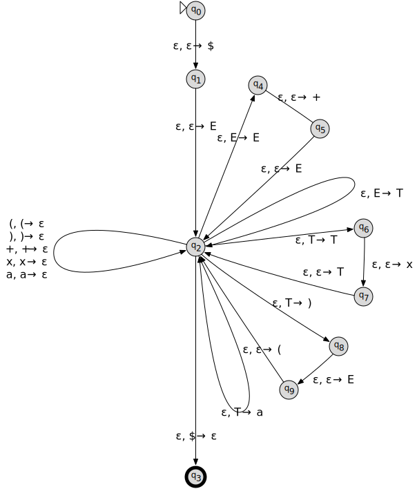

# FOCS Homework 10, for Day 11

You may edit your answers into this file, or add a separate file in the same directory.

If you add a separate file, please include the following at the top:

```
Student Name: Solution Set
Check one:
[ ] I completed this assignment without assistance or external resources.
[X] I completed this assignment with assistance from ALL COURSE STAFF
   and/or using these external resources: ___
```

## I. Logic

### 1.

The following tables are [truth tables](https://en.wikipedia.org/wiki/Truth_table).

_true_ and _false_ are represented by `T` and `F`. _OR(false, true)_ is commonly written in [infix notation](https://en.wikipedia.org/wiki/Infix_notation): `F OR T`.

The second table shows the value of the function _a OR b_, for all possible values _a_ and _b_. For example, _false OR true_ (the second row) has the value _true_ (the final cell of that row).

_a_ | _b_ | _a_ AND _b_
----|-----|---
 F  |  F  | F
 F  |  T  | F
 T  |  F  | F
 T  |  T  | T

_a_ | _b_ | _a_ OR _b_
----|-----|---
 F  |  F  | F
 F  |  T  | T
 T  |  F  | T
 T  |  T  | T

_a_ | _b_ | _a_ XOR _b_
----|-----|---
 F  |  F  | F
 F  |  T  | T
 T  |  F  | T
 T  |  T  | F

a. Construct the truth table for _a XOR (b XOR a)_.

**Solution:**

_a_ | _b_ | _b_ XOR _a_ | _a_ XOR (_b_ XOR _a_)
----|-----|-------------|---
F   | F   | F           | F
F   | T   | T           | T
T   | F   | T           | F
T   | T   | F           | T

Note that _a XOR (_b_ XOR _a_) = _b_. You can also prove this from the following (derived) equivalences:

* _a_ XOR (_b_ XOR _c_) = (_a_ XOR _b_) XOR _c_ – _associativity_ of XOR
* _a_ XOR _b_ = _b_ XOR _a_ – _commutativity_ of XOR
* 0 XOR _a_ = _a_ – 0 is an *identity* for XOR
* _a_ XOR _a_ = 0

Putting these together: _a_ XOR (_b_ XOR _a_) = _a_ XOR (_a_ XOR _b_) = (_a_ XOR _a_) XOR _b_ = 0 XOR _b_ = _b_.

This enables this one weird trick for swapping the values of two booleans without using a temporary variable:

	a := a XOR b  # now (a, b) = (a0 XOR b0, b0), where (a0, b0) are the original values of a and b
	b := a XOR b  # now (a, b) = (a0 XOR b0, (a0 XOR b0) XOR b0) = (a0 XOR b0, a0)
	a := a XOR b  # now (a, b) = ((a0 XOR b0) XOR a0, a0) = (b0, a0) 

This also works on integers. Python (and C, and Java) `a ^= b` is equivalent to `a = a ^ b`; `^` is [bitwise xor](https://en.wikipedia.org/wiki/Bitwise_operation#XOR).

	>>> a, b = 1729, 42  # a, b = binary 11011000001, 00000101010
	>>> a ^= b           # a, b = binary 11011101011, 00000101010
	>>> b ^= a           # a, b = binary 11011101011, 11011000001
	>>> a ^= b           # a, b = binary 00000101010, 11011000001
	>>> a, b
	(42, 1729)

b. Which function corresponds to the English word "or", as used in "You will eat your meat OR you can't have any pudding" (where _a_ = "You will eat your meat" and _b_ = "you can't have any pudding").

**Solution:**

That sentence typically entails "If you eat your meat, you can have pudding", which matches the truth table of `XOR` and not `OR`. A cooperative interlocutor would not say "You ate your meat and now you can't have pudding. Since 'you will eat your meat' and 'you can't have pudding' are both true, 'you will eat your meat OR you can't have pudding' is also true."

## II. Questions 2–6 are the same as in-class activities 2-6

### 2.

Consider the following context-free grammar G:

```
E -> E + E | T         # <- added "| T"
T -> T x T | (E) | a
```

Convert G to a PDA.

**Solution:**



### 3.

Convert grammar G from (2) to Chomsky Normal Form.

**Solution:**

This solution applies the conversion to the abbreviated representation of the grammar, that uses disjunctions on the right-hand sides. It shows the same steps as though `E -> E + E | T` were expanded to `E -> E + E` and `E -> T`, and similarly for `T -> T x T | (E) | a`.

1. Introduce a new start variable:

   	S -> E
   	E -> E + E | T
   	T -> T x T | (E) | a

2. Remove epsilon rules. This grammar has none, so we're done with this step.

3. Remove unit rules:

   	S -> E
   	E -> E + E | T x T | (E) | a
   	T -> T x T | (E) | a

4a. Introduce intermediate variables for long (>2 item) right-hand sides:

		S -> E
		E -> E E1 | T E2 | ( E3 | a
		E1 -> + E
		E2 -> x T
		E3 -> E )
		T -> T T1 | ( T2 | a
		T1 -> x T
		T2 -> E )

4b. Introduce intermediate variables for single-terminal right-hand sides:

		S -> E
		E -> E E1 | T E2 | L E3 | a
		E1 -> P E
		E2 -> X T
		E3 -> E R
		T -> T T1 | L T2 | A
		T1 -> X T
		T2 -> E R
		L -> (
		R -> )
		P -> +
		X -> x
		A -> a

Note that if we were being smart, instead of following the general algorithm to normalize a grammar, we could have chosen to apply (4a) to `T -> T x T` *before* removing unit rules; or we could have combined `E2` with `T1` and `E3` with `T2`.

The procedure in Sipser 2.9 is guaranteed to *always* produce an equivalent Chomsky normal form grammar. It does not in the general case do so in the *shortest number of steps*, nor does it in general produce the *smallest grammar*.

### 4.

Is the grammar G's language a regular language? If yes, produce a FSA or regular expression for this language. If not, show this.

**Solution:**

G's language L is not a regular language.

Here's a sketch of the proof:

Use the pumping lemma to demonstrate this. Here's a start:

L contains these strings:

	(a)
	((a))
	(((a)))
	((((a))))

and in general all strings `(`'s followed by an `a` followed by `)`s where the number of `(`s is equal to the number of `)`s.

Lemma #1: L contains no strings with an unequal number of `(`s and `)`s.

Proof intuition: only `T -> (E)` derives a `(` or `)`, and it derives an equal number of `(` and `)`.

Proof sketch: let P(n) be the claim that all strings derived with n or fewer derivation steps contain an equal number of `(` and `)`. **Basis**: S contains an equal number (0) of `(` and `)`; therefore P(0). **Inductive step**: if S derives w in n steps, P(n) states that w contains c `(`s = c `)`s. The substitution `T -> (E)` derives a string w' with c+1 `(`s = c + 1 `)`s. The other substitions derive a string w' with c `(`s = c `(s`. In each case, w' contains the same number of `(`s and `)`s. Therefore P(n) entails P(n + 1).

Lemma #2: L contains no strings with more than one `a`, but without `+` or `x`.

Proof sketch: Similar to lemma #1.

For any number _p_ we can choose a string _w_ with length greater than _p_: choose _p_ `(`s followed by `a` followed by p `)`s.

Substrings of _w_ partition into these categories:

1. those to the left of the `a`, that include only `(`s
2. those to the right of the `a`, that contain only `)`s
3. those that include the `a`

Pumping a substring in category (1) yields a string with more `(`s than `)`s. By lemma #1, the pumped string isn't a member of L.

Pumping a substring in category (2) yields a string with more `)`s than `(`s. By lemma #1, the pumped string isn't a member of L.

Pumping a substring in category (3) yields a string with more than one `a` but no `+` or `x`. By lemma #2, the pumped string isn't a member of L.

### 5.

Theorem 1: The language {a^n b^n c^n} is not a context-free language.

a. Use Theorem 1, together with the languages {a^i b^i c^j} and {a^i b^j c^j}, to show that the set of context-free languages is not closed under intersection.

**Solution:**

G1's language is L1 = {a^i b^i c^j}. G2's language is L2 = {a^i b^j c^j}. L1 and L2 are therefore context-free languages.

The intersection of L1 and L2 is L3 = {a^n b^n c^n}.

By theorem 1, L3 is not a context-free language. Therefore, L1 ∩ L2 = L3, L1 ∈ CFL, L2 ∈ CFL, L3 ∉ CFL is a counter-example to the proposition that the set of context-free languages is closed under intersection.

b. Use the pumping lemma for context-free languages [Sipser pp. 125] to prove Theorem 1.

**Solution:**

The pumping lemma for context-free languages says that if L is a context-free language, then any sufficiently large word _w_ of L can be divided into w = uvxyz such all vy is not empty and all words u v^n x y^n z are in L.

Given p, choose |w| > p by letting w = a^p b^p c^p.

One of the following conditions holds:

1. v includes both a's and b's. Then v^2 has the form a…b…a…b…, and u v^2 x y^2 z has the form a…b…a…b…c….
2. v includes both b's and c's. Then v^2 has the form b…c…b…c…, and u v^2 x y^2 z has the form a…b…c…b…c….
3. y includes both a's and b's. Then y^2 has the form a…b…a…b…, and u v^2 x y^2 z has the form a…b…a…b…c…. 
4. y includes both b's and c's. Then y^2 has the form b…c…b…c…, and u v^2 x y^2 z has the form a…b…c…b…c…. 
5. v includes only a's and y includes only b's. Then u v^2 x y^2 z includes more a's and more b's than u v x y z = a^p b^p c^p, but no more c's.
6. v includes only a's and y includes only c's. Then u v^2 x y^2 z includes more a's and more c's than u v x y z = a^p b^p c^p, but no more b's.
7. v includes only b's and y includes only c's. Then u v^2 x y^2 z includes more b's and more c's than u v x y z = a^p b^p c^p, but no more a's.

In cases (1-4), u v^2 x y^2 z doesn't have the form a…b…c…, because there's an occurrence of ba of of cb, and is therefore not in the language a^n b^n c^n.

In cases (5-7), u v^2 x y^2 z has either more a's than c's (5), more a's than b's (6), or more b's than a's (7), and is therefore not in the language a^n b^n c^n.

The wikipedia has a [different proof](https://en.wikipedia.org/wiki/Pumping_lemma_for_context-free_languages#Usage_of_the_lemma), that requires fewer cases but more sophisticated reasoning.

### 6.

Consider the context-free grammar G:

```
S -> NP VP
NP -> NP PP
NP -> DET N
VP -> V NP
VP -> VP PP
DET -> a | the
N -> boy | girl | flowers | binoculars # should be `flower`
V -> touches | sees
PP -> P NP
P -> in | from | with
```

a. Show that the string "the girl touches the boy with the flower" has two
different leftmost derivations.

**Solution:**

1. S -> NP VP PP -> DET N VP PP -> the N VP PP -> the girl VP PP -> the girl V NP PP -> the girl touches NP PP -> the girl touches DET N PP -> the girl touches the N PP -> the girl touches the boy PP -> the girl touches the boy P NP -> the girl touches the boy with NP -> the girl touches the boy with DET N -> the girl touches the boy with the N -> the girl touches the boy with the flower

2. S -> NP VP -> DET N VP -> the N VP -> the girl VP -> the girl V NP -> the girl touches NP -> the girl touches NP PP -> the girl touches DET N PP -> the girl touches the N PP -> the girl touches the boy PP -> the girl touches the boy P NP -> the girl touches the boy with NP -> the girl touches the boy with DET N -> the girl touches the boy with the N -> the girl touches the boy with the flower

b. Describe in English the two different meanings of this sentence.

**Solution:**

1. The first derivation creates a parse tree that can be summarized as (the girl (touches (the boy) (with the flower)). It is synonymous with "the girl uses a flower to touch the boy".

2. This second derivation creates a parse tree that can be summarized as (the girl (touches (the boy with the flower))). It is synonymous with "the boy with the flower – the girl touches him", or "the girl touches the boy who has a flower".

c. Use G to generate another ambiguous sentence.

**Solution:**

"the girl sees the boy with the binoculars" can be parsed as either:

1. (the girl (sees (the boy) (with the binoculars))) = "the girl uses the binoculars to see the boy"

2. (the girl (sees (the boy with the binoculars))) = "the girl sees the boy who has the binoculars"

d. Modify G so that it generates strings with adjectives: `the girl saw the tall boy`, `the girl touches the boy with a purple flower`.

**Solution:**

Add:

	N -> ADJ N
	ADJ -> tall | purple

Alternatively, add:

	NP -> DET ADJ N
	ADJ -> tall | purple

or:

	NP -> ADJ NP
	ADJ -> tall | purple

[Adapted from Sipser 2.8.]
