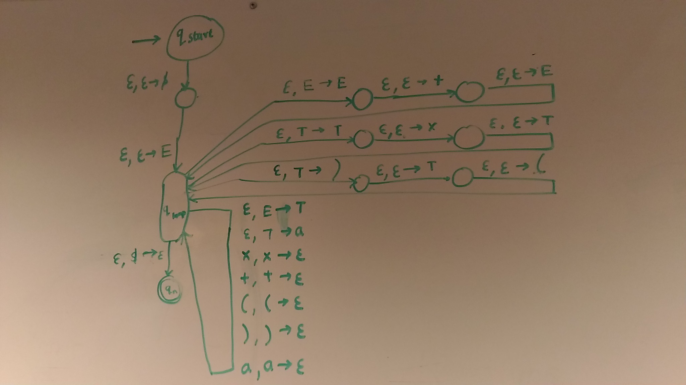

# FOCS Homework 10, for Day 11

You may edit your answers into this file, or add a separate file in the same directory.

If you add a separate file, please include the following at the top:

```
Student Name: Shruti Iyer
Check one:
[ ] I completed this assignment without assistance or external resources.
[X] I completed this assignment with assistance from Annabel, David (I worked with them)
   and/or using these external resources: http://math.stackexchange.com/questions/520817/closed-under-intersections
```

## I. Logic

### 1.

The following tables are [truth tables](https://en.wikipedia.org/wiki/Truth_table).

_true_ and _false_ are represented by `T` and `F`. _OR(false, true)_ is commonly written in [infix notation](https://en.wikipedia.org/wiki/Infix_notation): `F OR T`.

The second table shows the value of the function _a OR b_, for all possible values _a_ and _b_. For example, _false OR true_ (the second row) has the value _true_ (the final cell of that row).

_a_ | _b_ | _a_ AND _b_
----|-----|---
 F  |  F  | F
 F  |  T  | F
 T  |  F  | F
 T  |  T  | T

_a_ | _b_ | _a_ OR _b_
----|-----|---
 F  |  F  | F
 F  |  T  | T
 T  |  F  | T
 T  |  T  | T

_a_ | _b_ | _a_ XOR _b_
----|-----|---
 F  |  F  | F
 F  |  T  | T
 T  |  F  | T
 T  |  T  | F

a. Construct the truth table for _a XOR (b XOR a)_.

_b_ | _a_ | _b_ XOR _a_ | _a XOR (b XOR a)_
----|-----|-------------|-------------------
 F  |  F  | F 			| F
 T  |  F  | T 			| T
 F  |  T  | T 			| F
 T  |  T  | F 			| T

b. Which function corresponds to the English word "or", as used in "You will eat your meat OR you can't have any pudding" (where _a_ = "You will eat your meat" and _b_ = "you can't have any pudding").

_You will eat your meat_ | _You can't have any pudding_ | _Is this correct?_
-------------------------|------------------------------|--------------------
        F                |         F                    |        F
        F                |         T                    |        T
        T                |         F                    |        T
        T                |         T                    |        F

## II. Questions 2–6 are the same as in-class activities 2-6

### 2.

Consider the following context-free grammar G:

```
E -> E + E | T         # <- added "| T"
T -> T x T | (E) | a
```

Convert G to a PDA.



### 3.

Convert grammar G from (2) to Chomsky Normal Form.

```
E -> E + E | T 
T -> T x T | (E) | a
```
Add an extra variable

```
E0 -> E
E  -> E + E | T 
T  -> T x T | (E) | a
```
Remove unit rules

```
E0 -> E + E | T x T | (E) | a
E  -> E + E | T x T | (E) | a 
T  -> T x T | (E) | a
```
Convert remaining rules to proper Chomsky format

```
E0 -> E M1 | T M2 | (M3 | a
E  -> E M1 | T M2 | (M3 | a 
T  -> T M2 | (M3 | a
M1 -> + E
M2 -> x T
M3 -> E)
```
Convert any F -> aX into proper format
```
E0 -> E M1 | T M2 | N1 M3 | a
E  -> E M1 | T M2 | N1 M3 | a 
T  -> T M2 | N1 M3 | a
M1 -> N2 E
M2 -> N3 T
M3 -> E N4
N1 -> (
N2 -> +
N3 -> x
N4 -> )
```

### 4.

Is the grammar G's language a regular language? If yes, produce a FSA or regular expression for this language. If not, show this. 

Not a regular language.

This language can only produce strings with equal number of open and close parenthesis. They will always be balanced

`(a)`, `((a))`,`(((a)))`,`(((a)))` are all in the language. Let's say we pumped `((` in `(((a)))`, the resulting string will be `(((((((a)))` which is not in the language. 

`E`### 5.

Theorem 1: The language {a^n b^n c^n} is not a context-free language.

a. Use Theorem 1, together with the languages {a^i b^i c^j} and {a^i b^j c^j}, to show that the set of context-free languages is not closed under intersection.

Definition: **A collection C of subsets of E is said to be closed under intersections if A ∩ B belongs to C whenever A and B belong to C.**

Let's first prove that the two languages A = {a^i b^i c^j} and B = {a^i b^j c^j} are CFls by writing down their CFGs. This was already done in hw9. So I just copied my answers from there.

For A:
```
S→XY
X→aXb
X→ε
Y→cY
Y→ε
```

For B:
```
S→XY
X→Xa
X→ε
Y→bYc
Y→ε
```

The intersection of A ∩ B is {a^i b^i c^i} which is not a CFL. Hence, it is not closed under intersection

b. Use the pumping lemma for context-free languages [Sipser pp. 125] to prove Theorem 1.

For a string `aaabbbccc` that is in the language, let us choose a sub-string `aa` in `aaabbbccc`. If we pump it to get `aaaaaaabbbccc`, the string is no longer in the language. So we proved that language {a^n b^n c^n} is not a context-free language.

### 6.

Consider the context-free grammar G:

```
S -> NP VP
NP -> NP PP
NP -> DET N
VP -> V NP
VP -> VP PP
DET -> a | the
N -> boy | girl | flowers | binoculars
V -> touches | sees
PP -> P NP
P -> in | from | with
```

a. Show that the string "the girl touches the boy with the flower" has two
different leftmost derivations.

```
S -> NP VP -> DET N VP -> the N VP -> the girl VP -> the girl V NP -> the girl touches NP -> the girl touches NP PP -> the girl touches DET N PP -> the girl touches the N PP -> the girl touches the boy PP -> the girl touches the boy P NP -> the girl touches the boy with NP -> the girl touches the boy with DET N -> the girl touches the boy with the N -> the girl touches the boy with the flower
```

```
S -> NP VP -> DET N VP -> the N VP -> the girl VP -> the girl VP PP -> the girl V NP PP -> the girl touches NP PP-> the girl touches DET N PP -> the girl touches the N PP -> the girl touches the boy PP -> the girl touches the boy P NP -> the girl touches the boy with NP -> the girl touches the boy with DET N -> the girl touches the boy with the N -> the girl touches the boy with the flower
```

b. Describe in English the two different meanings of this sentence.

The girl uses a flower to touch a boy.

The girl touches a boy who is holding a flower.

c. Use G to generate another ambiguous sentence.

```
S -> NP VP -> DET N VP -> the N VP -> the girl VP -> the girl VP PP -> the girl V NP PP -> the girl sees NP PP-> the girl sees DET N PP -> the girl sees the N PP -> the girl sees the flowers PP -> the girl sees the flowers P NP -> the girl sees the flowers with NP -> the girl sees the flowers with DET N -> the girl sees the flowers with the N -> the girl sees the flowers with the binoculars 
```

d. Modify G so that it generates strings with adjectives: `the girl saw the tall boy`, `the girl touches the boy with a purple flower`.

```
S -> NP VP
NP -> NP PP
NP -> DET N
**N -> J N**
VP -> V NP
VP -> VP PP
DET -> a | the
N -> boy | girl | flowers | binoculars
V -> touches | sees | **saw**
PP -> P NP
P -> in | from | with
**J -> purple | tall**
```

```
S -> NP VP -> DET N VP -> the N VP -> the girl VP -> the girl V NP -> the girl V DET N -> the girl saw DET N -> the girl saw the N -> the girl saw the J N -> the girl saw the tall N -> the girl saw the tall boy   
```
You don't need to know this, but here's how the variable names relate to linguistics.

Variable | meaning
---|---
S | sentence
DET | determiner (article)
N | noun
NP | noun phrase
P | preposition
PP | prepositional phrase
V | verb
VP | verb phrase

[Adapted from Sipser 2.8.]
