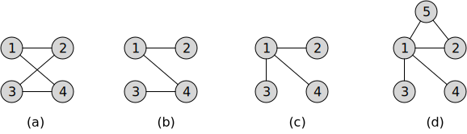
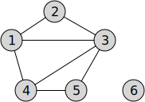
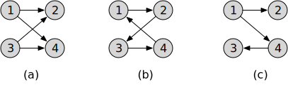
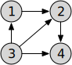

# FOCS Homework 16

```
Student Name: Solution Set
Check one:
[ ] I completed this assignment without assistance or external resources.
[x] I completed this assignment with assistance from teaching staff
   and/or using these external resources: ___
```

## I. (Undirected) Graphs

### 1. Match the diagrams to the graph structures.



(i) *G* = ({1, 2, 3, 4}, {{1, 2}, {1, 4}, {3, 4}})

(ii) *G* = ({1, 2, 3, 4}, {{1, 2}, {1, 4}, {2, 3}, {3, 4}})

(iii) *G* = ({1, 2, 3, 4, 5}, {{1, 2}, {1, 3}, {1, 4}, {1, 5}, {2, 5}})

(iv) *G* = ({1, 2, 3, 4}, {{1, 2}, {1, 4}, {1, 3}})

**Solution**:

(i) – (b)

(ii) – (a)

(iii) –(d)

(iv) – (c)

()

### 2. Cycles

Which of (1a-d) contains a cycle? For those graphs that contain a cycle, what is the cycle?

**Solution**:

(a) yes: 1–2–3–4–1 (= 1-4-3-2-1, 2–3–4–1–2, etc.)

(b) no

(c) no

(d) no

(e) yes: 1-2-5-1 (= 1-5-2-1, 2-5-1-2, etc.)

### 3. Draw a diagram for this graph.

*G* = ({1, 2, 3, 4, 5}, {{1, 2}, {2, 3}, {3, 4}, {4, 5}, {1, 5}})

**Solution**:


### 4. Write the graph (V, E) for this diagram.



This is a single graph. It is not a **connected graph**.

**Solution**:

*G* = ({1, 2, 3, 4, 5, 6}, ({1, 2}, {1, 4}, {2, 3}, {3, 4}, {4, 5}))

## II. Directed Graphs

### 5. Match the diagrams to the graphs.



(i) *G* = ({1, 2, 3, 4}, {(1, 2), (1, 4), (3, 2), (3, 4)})

(ii) *G* = ({1, 2, 3, 4}, {(1, 2), (1, 4), (4, 3)})

(iii) *G* = ({1, 2, 3, 4}, {(1, 2), (4, 1), (2, 3), (3, 4)})

**Solution**:

(i) – (a)

(ii) –(c)

(iii) –(b)

()

### 6. Directed acyclic graphs

Which of (5a-c) are DAGs?

(a) Yes. It is is a directed graph, and it is cycle-free. The arrow directions 1→2←3→4←1 do not match up to make a cycle.

(b) No. It is a directed graph, but there is a cycle 1→2→3→4→1

(c) Yes. It is a directed graph, and there is no cycle.

### 7. Draw a diagram for this graph.

*G* = ({1, 2, 3, 4}, {(1, 2), (2, 3), (3, 4), (4, 1), (1, 3)})

**Solution**


This graph is a DAG.

### 6. Write the graph (V, A) for this diagram.



**Solution**

G = (V, A) = ({1, 2, 3, 4}, {(1, 2), (2, 4), (3, 1), (3, 2), (3, 4)})

### 7. Adjacency matrices 

Write the adjacency matrix for the graph in (5a).

**Solution**

|       | $V_1$ | $V_2$ | $V_3$ | $V_4$ |
| ----- | ----- | ----- | ----- | ----- |
| $V_1$ | 0     | 1     | 0     | 1     |
| $V_2$ | 0     | 0     | 0     | 0     |
| $V_3$ | 0     | 1     | 0     | 1     |
| $V_4$ | 0     | 0     | 0     | 0     |

**Optional material**

Or:

|       | $V_1$ | $V_2$ | $V_3$ | $V_4$ |
| ----- | ----- | ----- | ----- | ----- |
| $V_1$ |       | 1     |       | 1     |
| $V_2$ |       |       |       |       |
| $V_3$ |       | 1     |       | 1     |
| $V_4$ |       |       |       |       |

or:

|       | $V_1$ | $V_2$ | $V_3$ | $V_4$ |
| ----- | ----- | ----- | ----- | ----- |
| $V_1$ | ∞     | 1     | ∞     | 1     |
| $V_2$ | ∞     | ∞     | ∞     | ∞     |
| $V_3$ | ∞     | 1     | ∞     | 1     |
| $V_4$ | ∞     | ∞     | ∞     | ∞     |

The top matrix has elements of type integer.

The second matrix has elements of type nullable integer (C# `Nullable<int>`; Scala `Option[int]`; Swift `Int?`). The empty cells might be represented by `None` (Python); `NULL` (SQL), or `null` (JavaScript, Scala, Scheme). This representation can be useful in a *weighted* graph: to represent the distinction between an edge (whose weight might be zero, and is represented by a number), and the absence of an edge (null).

The third representation, using *infinity*, is useful to eliminate setup or conditionals in an algorithm that computes or refines the path length between pairs of vertices.

In a language with a fixed-precision integer, ∞ can be approximated by the maximum integer size (Python 2.7 `sys.maxsize`, Scala, `int.MaxValue` ), so long as you remember only to *compare* with these values, not to *add* them.

 In all languages that support [IEEE floating point](https://en.wikipedia.org/wiki/IEEE_floating_point) (that is, most languages that run on a microprocessor), an array that stores floating point numbers can represent ∞ directly (JavaScript `Infinity`, Python `float('inf')`, Python 3.x `math.inf`, Scala `Double.PositiveInfinity`, Scheme `+Inf.0`). In this case it is safe to add them.

