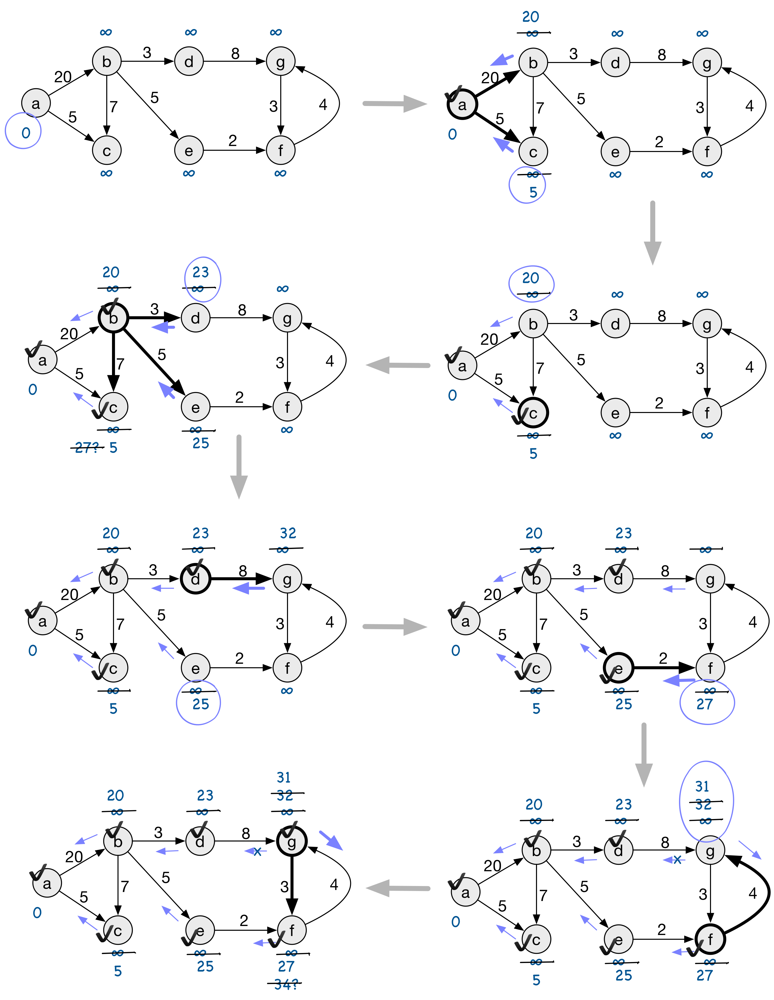

# FOCS Homework #17 Solutions

## 1. Spanning Trees
Modify bfs to construct a spanning tree.

1. First strategy: add a `parent` attribute to each node.


```python
import itertools
from queue import Queue
from bft_w_obj_nodes import g  # the test graph

def create_spanning_tree(graph, start):  # <- renamed from `bfs`
    """Use breadth-first search to create a spanning tree.
    Adds a `parent` attribute to each reachable node in the graph."""
    
    remaining_nodes = Queue()
    visited = set()

    def visit(node):
        # print(node)  <- removed
        
        visited.add(node)
        for tail in graph.successors(node):
            if tail not in visited:
                tail.parent = node  # <- added
                remaining_nodes.put(tail)

    start.parent = None  # <- added
    remaining_nodes.put(start)
    while not remaining_nodes.empty():
        n = remaining_nodes.get()
        visit(n)

def print_spanning_tree(graph):
    """Given a spanning tree represented as nodes in a graph connected by a `parent` attribute,
    print it as an indented tree.
    
    This implementation requires that there's a single spanning tree. If the graph is partitioned
    into a spanning forest of more than one tree, it uses an unspecified algorithm to select one
    such tree in an unspecified."""
    
    # Accumulate a dict node.label -> children. This is keyed by the node label rather than the node,
    # because instances of Node aren't valid hash key.
    #
    # An alternative implementation would be to add a `children` attribute to the nodes.
    # This is simpler, but it seems rude for a `print` function to modify its argument.
    def parent_label(node):
        return node.parent.label if node.parent else ''
    node_children = dict((label, list(children))
                         for label, children in itertools.groupby(sorted(graph.nodes, key=parent_label), key=parent_label)
                         if label)

    def print_subtree(node, indent=0):
        print('  ' * indent + node.label)
        for child in node_children.get(node.label, []):
            print_subtree(child, indent + 1)
        
    # Find the (possibly improper) ancestor. If the `parent` structure has more than one graph,
    # find the ancestor of the first node in the graph's list of nodes.
    #
    # (This also sneaks in the software engineering idea of the difference between API documentation
    # and internal comments. The docstring doesn't commit the method to this algorithm, in order
    # to leave it to the implementor to change strategies. The comment goes ahead and documents
    # the actual design, even though it's not part of this function's contract.)
    root = next(n for n in graph.nodes if not n.parent)
    print_subtree(root)
    

create_spanning_tree(g, g.nodes[0])
print_spanning_tree(g)
```

    a
    b
    c
    d
    e
    a
      b
        d
        e
      c


2\. Second strategy: construct a new graph.


```python
from queue import Queue
from graph import Graph, g  # the test graph

def create_spanning_tree(graph, start):  # <- renamed from `bfs`
    """Use breadth-first search to create a spanning tree.
    Returns a new graph."""
    
    remaining_nodes = Queue()
    visited = set()
    
    new_nodes, new_edges = set(), []  # <- added

    def visit(node):
        # print(node)  <- removed
        new_nodes.add(node)  # <- added
        
        visited.add(node)
        for tail in graph.successors(node):
            if tail not in visited:
                new_edges.append((node, tail))  # <- added
                remaining_nodes.put(tail)

    remaining_nodes.put(start)
    while not remaining_nodes.empty():
        n = remaining_nodes.get()
        visit(n)

    return Graph(visited, new_edges)


def print_graph(graph):
    for head, tails in graph.adjacency_list.items():
        for tail in tails:
            print('{} -> {}'.format(head, tail))

print_graph(create_spanning_tree(g, g.nodes[0]))
```

    a
    b
    c
    d
    e
    b -> d
    b -> e
    a -> b
    a -> c


## 2. Single-Source Distance (without weights)
Modify bfs so that it records the distance (number of edges) from the start node to each node that a path can reach.

1. First strategy: add a `distance` attribute to each node.


```python
from queue import Queue
from bft_w_obj_nodes import g  # the test graph

def assign_distances(graph, start):  # <- renamed from `bfs`
    """Record the distance from the start node to each reachable node.
    Adds a `distance` attribute to each reachable node in the graph."""
    
    remaining_nodes = Queue()
    visited = set()

    def visit(node, distance):
        # print(node)  <- removed
        node.distance = distance  # <- added
        
        visited.add(node)
        for tail in graph.successors(node):
            if tail not in visited:
                remaining_nodes.put((tail, distance + 1))

    start.parent = None  # <- added
    remaining_nodes.put((start, 0))  # <- made this a tuple of (node, distance)
    while not remaining_nodes.empty():
        n, distance = remaining_nodes.get()
        visit(n, distance)

assign_distances(g, g.nodes[0])
for n in g.nodes:
    print(n, n.distance)
```

    a 0
    b 1
    c 1
    d 2
    e 2


2\. Second strategy: Return a structure that maps nodes to distances


```python
from queue import Queue
from bft_w_obj_nodes import g  # the test graph

def create_distance_map(graph, start):
    """Record the distance from the start node to each reachable node.
    Returns a map from node label -> distance."""
    
    remaining_nodes = Queue()
    visited = set()
    distances = {}  # <- added

    def visit(node, distance):
        # print(node)  <- removed
        distances[node.label] = distance  # <- added
        
        visited.add(node)
        for tail in graph.successors(node):
            if tail not in visited:
                remaining_nodes.put((tail, distance + 1))

    start.parent = None  # <- added
    remaining_nodes.put((start, 0))  # <- made this a tuple of (node, distance)
    while not remaining_nodes.empty():
        n, distance = remaining_nodes.get()
        visit(n, distance)
    
    return distances

print(create_distance_map(g, g.nodes[0]))
```

    {'a': 0, 'e': 2, 'c': 1, 'd': 2, 'b': 1}


## 3. Single-Source Distance With Weights


