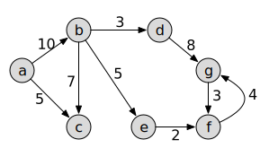

# FOCS Homework 17

## 1. Spanning Trees

This is a Python rendition of the BFS pseudocode from the in class exercise:

``` python
def bfs(graph, start):
    """Graph breadth-first search.
    
    1. create a sequence that contains only node a
    2. until the collection is empty:
    3.    remove node n from the head of the sequence and visit it
    4.
    5. to visit a node:
    6.    add unvisited adjacent nodes to the tail of the sequence"""
    remaining_nodes = Queue()
    visited = set()

    def visit(node):
        print(node)
        visited.add(node)
        for tail in graph.successors(node):
            if tail not in visited:
                remaining_nodes.put(tail)

    remaining_nodes.put(start)
    while not remaining_nodes.empty():
        n = remaining_nodes.get()
        visit(n)
```
`bfs` prints the nodes as it visits them.

Modify this function to construct a [spanning tree](https://en.wikipedia.org/wiki/Spanning_tree) instead.

You can use one of two strategies to represent the spanning tree:

1. Add a `parent` attribute to each node: `node.parent = …` .  This adds a set of references to the existing nodes. The `parent` attributes define a path from each leaf or internal node of the spanning tree, to the BFS start (the tree's root).
2. Construct a *new* graph. Add nodes and edges to it. This graph is a [spanning subgraph](https://en.wikipedia.org/wiki/Glossary_of_graph_theory#subgraph). You may use the [graph abstract data type operations](https://en.wikipedia.org/wiki/Graph_(abstract_data_type)#Operations) of the input graph to construct the tree.

You can do this in any programming language. If you choose to use Python, you can use these files to test your code:

* `graph.py` contains an implementation of the graph data type and the `bfs` function. The test code uses strings `'a'`, `'b'`, as nodes.
* `bfs_with_obj_nodes` is an alternate implementation that uses objects as nodes, and contains some utility functions that makes node objects easier to work with. If you add attributes to the nodes (instead of creating a new graph), you'll want to use `bfs_with_obj_nodes`, since you can't add an attribute to a string.

## 2. Single-Source Distance (without weights) 

Modify the Python code in (1) – or supply your own implementation in another language – so that it records the distance (number of edges) from the start node to each node that a path can reach.

As with (1), there are two ways to do this:

1. Add a `distance` attribute to each node. This requires that nodes are objects.
2. Return a structure that maps nodes to distances. For example: if nodes are represented by single-letter strings `'a'`, `'b'`, `'c'`, etc., then `bfs` could return a dictionary `{'a': 0, 'b': 1, 'c': 1}`.

The first strategy is a relatively straight-forward implementation of [this algorithm](https://en.wikipedia.org/wiki/Breadth-first_search#Pseudocode).

## 3. Single-Source Distance With Weights

Read about Dijsktra's Algorithm in your favorite algorithm text, or [Wikipedia](https://en.wikipedia.org/wiki/Dijkstra%27s_algorithm#Algorithm). Apply it (manually) to the following graph. How does it label the nodes?



## 4. Reading: Graphs
One of:

* Cormen *et al.* Section 6 “Graph Algorithms”, Chapters 22-24.
* Rawlins pp. 305-342
* Equivalent material in your favorite data structures text: graphs, spanning trees, bread-first search, depth-first search, Dijskstra's algorithm.
* Wikipedia: [Graph](https://en.wikipedia.org/wiki/Graph_(discrete_mathematics)), [graph data type](https://en.wikipedia.org/wiki/Graph_(abstract_data_type)), [directed graph](https://en.wikipedia.org/wiki/Directed_graph), [adjacency matrix](https://en.wikipedia.org/wiki/Adjacency_matrix), [bread-first search](https://en.wikipedia.org/wiki/https://en.wikipedia.org/wiki/Breadth-first_search), [depth-first search](https://en.wikipedia.org/wiki/Depth-first_search)
## 5. (Optional) Reading: Dynamic programming

One of:

* Cormen et al. Chapters 15-16
* Equivalent material in your favorite algorithms text: dynamic programming, greedy algorithms
* [Last restort – this is not one of the articles that is easy to learn from] Wikipedia: [Dynamic programming in computer programming](https://en.wikipedia.org/wiki/Dynamic_programming#Dynamic_programming_in_computer_programming)