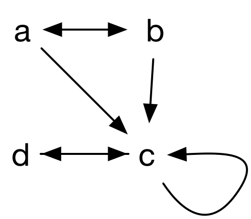
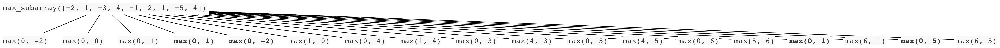
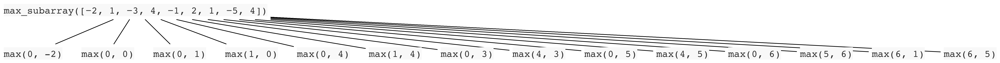

# FOCS Homework 19

```
Student Name: Solution Set
Check one:
[ ] I completed this assignment without assistance or external resources.
[x] I completed this assignment with assistance from teaching staff
   and/or using these external resources: ___
```

## 1. Predicate Calculus – Models

| x    | y    |
| ---- | ---- |
| a    | b    |
| b    | c    |
| a    | c    |
| c    | d    |
| d    | c    |
| c    | c    |
| b    | a    |

*Table 1*: A model for `loves(x, y)`

a. For each of the following, is Table 1 a model?  Explain briefly why or why not.

1. ∃x. ∀y. loves(x, y)

   No. There is no x that loves everbody. a and b don't love d, therefore a and b don't work as x. c and d don't love a, therefore c and d don't work as x.

2. ∃y. ∀x. loves(c, y)
   Yes. Everybody loves c. Therefore there exists a y (y=c) such that everbody loves y.

3. ∀x. ∃y. loves(x, y)
   Yes. For everbody, there is someone that they love. a loves b, b loves a, c loves d, and d loves c.

4. ∀y. ∃x. loves(x, y)
   Yes. For everybody, there is someone who loves them. a loves b, b loves a, c loves d, and d loves c.

5. ∃x. ∃y. loves(x, y)
   Yes. There is someone who loves someone. For example, a loves b.

6. ∃x. ∀y. ¬loves(x, y)
   No. There is no who doesn't love anyone.

7. ∃x. ¬∀y. loves(x, y)
   Yes. There is someone who doesn't love everyone. For example, a doesn't love c.

b. Consider three models: (i) objects are a, b, c, d; `loves` is Table 1; (ii) objects are integers; `loves(x, y) ` ≝ x ≧ y; (iii) `loves(x, y)` ≝ x = y. In which of these models are these statements true:

| Statement                                | Table 1 | x ≧ y | x = y |
| ---------------------------------------- | ------- | ----- | ----- |
| ∀x, x. loves(x, x) [should read ∀x. loves(x, x)] | False   | True  | True  |
| ∀x, y. loves(x, y) → loves(y, x)         | False   | False | True  |
| ∀x, y, z. loves(x, y) ∧ loves(y, z) → loves(x, z) | False   | True  | True  |

∀x. loves(x, x): x=a is a counter-example. All integers are ≧ themselves by definition of ≧, and all integer are = themselves by definition of =, so the remaining two cells in the first row are true.

∀x, y. loves(x, y) → loves(y, x): {x=a, y=b} and {x=1, y=2} is a counter-example. If x = y then y = x (= is reflexive), so the third cell in the second row is true.

∀x, y, z. loves(x, y) ∧ loves(y, z) → loves(x, z): {a=a, y=b, z=c} is a counter-example. ≧ and = are transitive, so the second and third cells in the third row are true.

c. (Optional) (Because we love graphs) Draw Table 1 as a digraph. What claims do each of the following make about a node x or y, in terms of its indegree and outdegree?

The following graph represents likes(x, y) with an arrow x → y.



1. ∀x. loves(x, y).
   y has an indegree equal to the number of nodes in the graph. In this model, y has an indegree of 4. (There are four nodes, and ∀x quantifies over all of them.) This is true only for c.
2. ∀y. loves(x, y).
   x has an outdegree of 4. Since no node has outdegree > 3, there is no value for x that makes the proposition true.
3. ∃x. loves(x, y)
   y has an indegree of at least one. This is true of every node. (Everyone has someone who likes them.)
4. ∃y. loves(x, y)
   x has an outdegree of at least one. This is true of every node. (Everyone has someone they likes.)

likes(x, y) could also be represented by an opposite arrow y → x. With this graph, the use of “indegree” and “outdegree” in (1-4) would be swapped.

## 2. Predicate Calculus – Proofs

Given axioms:

1. ∀x. sum( x, 0, x )
2. ∀x, y, z. sum( x, y, z ) → sum( x, s(y), s(z) )
3. ∀x . product( x, 0, 0 )
4. ∀x, y, z, k. product( x, y, z ) ∧  sum( x, z, k ) → product( x, s(y), k )

Prove:

1.  ∃x. sum( x, x, s(s(0)) )

    ```
    1. ∀x. sum( x, 0, x )				axiom 1
    2. sum( s(0), 0, s(0) )				1, universal instantiation x = s(0)
    3. ∀x, y, z. sum( x, y, z ) → sum( x, s(y), s(z) )		axiom 2
    4. sum( s(0), 0, s(0) ) → sum( s(0), s(0), s(s(0)) )	3, universal instantiation with x = z = s(0), y = 0
    5. sum( s(0), s(0), s(s(0)) )		2, 4, modus ponens
    6. ∃x. sum( x, x, s(s(0)) )			5, existential generalization with x = s(0)
    ```

2.  ∀x. sum( 0, x, x ) [hint:  induction]

     ```
    1. ∀x. sum( x, 0, x )				axiom 1
    2. sum( 0, 0, 0 )					1, universal instantation with x = 0
    3. ∀x, y, z. sum( x, y, z ) → sum( x, s(y), s(z) )		axiom 2
    4. sum( 0, n, n ) → sum( 0, s(n), s(n) )				3, universal instantiation with x = 0, y = z = k
    5. ∀x. sum( 0, x, x )				1 (base case), 4 (inductive step), induction
     ```


3. [optional super-challenge] ∀x, y, z. sum( x, y, z ) → sum( y, x, z )
   Proof sketch:

   1. Prove ∀x, z. sum( x, S(0), z ) → sum( S(0), x, z )
   2. Prove ∀x, y, z. (sum( x, y, z ) → sum( y, x, z )) → (sum( x, S(y), z ) → sum( S(y), x, z ))
   3. Induction on 1, 2.

    ```
   TBD
    ```


## 3. Maximum Subarray

a. Draw a recursion graph of `max_subarray([−2, 1, −3, 4, −1, 2, 1, −5, 4])`.

`max_subarray` doesn't call itself, so a straight recursion graph (one node) is uninteresting.

Here's a call graph that includes `max`.



It makes calls to (in order): max(0, -2), max(0, 0), max(0, 1), **max(0, 1)**, **max(0, -2)**, max(1, 0), max(0, 4), max(1, 4), max(0, 3), max(4, 3), max(0, 5), max(4, 5), max(0, 6), max(5, 6), **max(0, 1)**, max(6, 1), **max(0, 5)**, max(6, 5). The bold calls items are calls that duplicate the arguments of a prior call.

b. Is `max_subarray` an example of divide and conquer? Why or why not?

No. D&C divides a problem into smaller similar problems. `max_subarray ` doesn't do this.

c. Is `max_subarray` an example of dynamic programming? Why or why not?

Arguably. [I thought yes when I wrote the question. There's [legitimate debate](http://stackoverflow.com/questions/16323792/dynamic-programming-aspect-in-kadanes-algorithm). The exam won't include anything this tricky or ambiguous.]

 The function updates values as it iterates over the input data. It uses the same technique in the final definition of `fib` in the **Bottom-Up Dynamic Programming** section of the [Dynamic Programming and the Fibonacci Function](https://github.com/focs16fall/focs-assignments/blob/master/day17/memoization_notes.ipynb) notebook, where the fact that only the last value from the table is required, is used to collapse the table into a single scalar that represents its last entry.

Here's an implementation that undoes this optimization, to make the tabular form of the algorithm clearer. Compare this to the original.

```python
def max_subarray(xs):
    max_so_far = [0] * len(xs)
    max_ending_here = [0] * len(xs)
    for i in range(1, len(xs)):
        max_ending_here[i] = max(0, max_ending_here[i - 1] + xs[i])
        max_so_far[i] = max(max_so_far[i - 1], max_ending_here[i - 1])
    return max_so_far[-1]
```

d. Draw the recursion graph for `memoized_max_subarray([−2, 1, −3, 4, −1, 2, 1, −5, 4])`.

The only point for memoization is `max`. This yields a minor improvement to the number of calls to max; since max is cheap, this isn't a clear win.

 Since `max_subarray` is already a (bottom-up) dynamic program, adding (top-down) dynamism doesn't buy much:



e. [Optional challenge] Produce working code for memoized `max_subarray`.