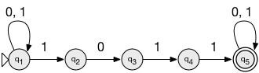
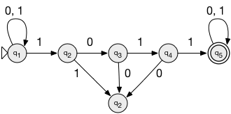
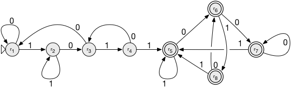
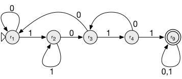

# FOCS Day 7 Homework Solutions

## Part 1: Finite Automata

You may use any of the following to answer these questions:

 - JFLAP
 - The DFA and NFA machines introduced in _Understanding Computation_ chapter 3 (in Ruby or translated into a language of your choice)
 - Your own home brew code (but please give us a heads up if you plan to do this, so we are prepared)
 - Pencil and paper (in which case you should also use a scanner, please)

Upload the results to GitHub.

### 1. Nondeterministic automaton

Build an automaton to recognize the following language:

All and only strings containing the substring 1011.

**Solution:**

**Alternate solution:**

With an explicit trap state:

### 2. Conversion to deterministic automaton

Convert the automaton you created for problem 1 into a deterministic automaton.  Provide the transition table explicitly.  (You may use JFLAP or Stuart's code to help, but you will likely learn more doing the translation by hand.  We picked a small enough machine that it shouldn't be painful.)

**Solution:**

Trace through the reachable sets of states.
Start from the set {q1} that contains just the automaton's start state.
Each time we reach a set of states that doesn't have an entry, add a new row.
Eventually we'll stop adding rows. (Why?)

| NFA states   | ∪ δ(_, `0`)  | ∪ δ(_, `1`) |
| ------------ | ------------ | ----------- |
| {q1}         | {q1}         | {q1, q2}
| {q1, q2}     | {q1, q3}     | {q1, q2}
| {q1, q3}     | {q1}         | {q1, q2, q4}
| {q1, q2, q4} | {q1, q3}     | {q1, q2, q5}
| {q1, q2, q5} | {q1, q3, q5} | {q1, q2, q5}
| {q1, q3, q5} | {q1, q5}     | {q1, q2, q4, q5}
| {q1, q5}     | {q1, q5}     | {q1, q2, q5}
| {q1, q2, q4, q5} | {q1, q3, q5} | {q1, q2, q5}

*Table 1: reachable NFA sets of states*

For each set of NFA states in Table 1, create a new DFA state label:

| NFA states       | DFA state |
| ---------------- | --------- |
| {q1}             | r1        |
| {q1, q2}         | r2        |
| {q1, q3}         | r3        |
| {q1, q2, q4}     | r4        |
| {q1, q2, q5}     | r5        |
| {q1, q3, q5}     | r6        |
| {q1, q5}         | r7        |
| {q1, q2, q4, q5} | r8        |

*Table 2: NFA sets of states, to DFA states*

Replace the sets of NFA states in Table 1 by the single DFA states in Table 2:

| DFA State | δ(_, `0`) | δ(_, `0`) |
| --- | --- | --- |
| r1  | r1  | r2  |
| r2  | r3  | r2  |
| r3  | r1  | r4  |
| r4  | r3  | r5  |
| r5  | r6  | r5  |
| r6  | r7  | r8  |
| r7  | r7  | r5  |
| r8  | r6  | r5  |

*Table 3: DFA states and transitions*

q1 is the NFA's initial state, so the DFA's initial state is the DFA state that corresponds to {q1}.

The DFA's accept states are those that correspond to a set of NFA states that include an NFA accept state. Here, the only NFA accept state is q5, so the DFA accept states are r5, r6, r7, and r8.

This concludes the NFA to DFA conversion algorithm. We can use reasoning[^1] to simplify this DFA:

r5, r6, r7, and r8 are all accept states, and all their transitions are to each other. (Careful! If there's an undrawn trap state, you can't tell this by looking only at the arrows. You need to verify that each state's outgoing arrows' labels cover the alphabet.) This means that once the automaton enters an accept state, it stays in an accept state. It therefore doesn't matter which of these accept states it's in; they might as well all be the same state.

Combining all the accept states r5, r6, r7, r8 into a single accept state r9 yields:

[^1]: There is also a DFA minimization algorithm that will do the same thing.

### 3. Larger alphabet

The automata we have considered so far accept only strings over the alphabet {0,1}.  Consider a machine that could accept strings over a larger alphabet, such as the English alphabet (`a` through `z`, at least; we'll ignore case and punctuation for the moment).  Would such a machine be more powerful?  Why or why not?  Try to construct a formal proof for your answer, at least for the alphabet {`a`,`b`,`c`,`d`}.

**Solution:**

“Power” in the context of formal language theory means [expressive power](https://en.wikipedia.org/wiki/Expressive_power_(computer_science)#Expressive_power_in_formal_language_theory).

Two sets of machines have the same expressive power if they accept the same sets of languages. Examples of sets of machines are (1) NFAs, (2) DFAs, (3) FSAs with Σ = {`0`, `1`}, and (4) FSAs with Σ = {`a`, `b`, `c`, `d`}. We've seen that the machines in (1) and (2) have the same expressive power. Question (3) is *related to* the question of whether the machines in (3) and (4) have the same expressive power.

One set of machines M1 has *greater* expressive power than another set M2, if for every machine in M2 there's a machine in M1 that accepts the same langauge, but not vice versa. For example, the set of FSA with fewer than five states has more expressive power than the set of FSAs with fewer than four states, because every FSA in the second set is in the first set, but only the first set contains an FSA that matches the language {0000}.

By this definition, neither the set of machines with Σ = {`0`, `1`} (`01`-machines) nor the set of machines with Σ = {`a`, `b`, `c`, `d`} (`abcd`-machines) has more expressive power than the other, because only the first set contains a machine that matches {`0`}, and only the second set contains a machine that matches {`a`}.

This is a bit uninteresting, so let's try a broader definition of expressive power:

Two languages are *equivalent* iff there's a one-to-one map between symbols in the first language's alphabet, and symbols in the second langauge's alphabet, such that the translated words of the first language are the words of the second language. Two sets of machines have the same expressive power if each machine in the first set accepts a language whose translation is accepted by a machine in the second set; and similarly for the definition of *greater* expressive power.

By this definition, the set of machines with Σ = {`a`, `b`, `c`, `d`} has greater expressive power than the set of machines with Σ = {`0`, `1`}, because the translation {`0` -> `a`, `1` -> `b`} sets up an equivalence between every language from {`0`, `1`}\* and a language from {`a`, `b`}\*, but there's no language in {`0`, `1`}\* that translates to the set {`a`, `b`, `c`}.

A broader definition of equivalence gives a different result. Two languages are *equivalent_2* iff there's a pair of non-zero integer _i_ and _j_, and a one-to-one map between _i_-length substrings of the first language and _j_-length substrings of the second language. A definition of expressive power built from *equivalence_2* assigns the set of `01`-machines and the set of `abcd`-machines equal expressive power. The map {`00` -> `a`, `01` -> `b`, `10` -> `c`, `11` -> `d`} translates between strings from {`0`, `1`}\* and strings from {`a`, `b`, `c`, `d`}\*, and we sketched in class how to construct the corresponding conversions between `01`-machines and `abcd`-machines.

When I was hunting around for how to answer this problem, I saw all three definitions of expressive power. They variously give the answer: neither `01`- nor `abcd`-machines are more powerful than the other; `abcd`-machines are more powerful than `01`-machines; and, `01`-machines and `abcd`-machines are equally powerful.

### 4. [*] Challenge: Reverse

Assume that you have a deterministic finite automaton A that recognizes a language L.  Show how to construct an automaton that recognizes L_reverse, that is, s is a string in L_reverse iff s_reverse -- s spelled backwards -- is in L.

Hint for prover types:  You may assume that A has a set of states Q = {q0, ... qn} and operates over the alphabet {0,1}; that A's start state is q0; that F, a subset of Q, is the set of A's accepting states; and that you have a transition table delta with rules of the form qi, x --> qj for x in {0,1}.

Hint for coder types:  You may assume that A was created by calling (your favorite language's equivalent of) DFA.new(q, qlist, DFARulebook.new(RuleList)), where q is an integer, qlist is a list of integers, and RuleList is a list of FARules.  Write a translation program that will produce an automaton that recognizes the reversed language.

Hint for everyone:  This problem is easier if your answer is nondeterministic.

[* You are strongly encouraged to try this problem.  You are also encouraged not to get caught up in it if you are going around in circles.]

**Solution:**

Proof idea:

* Flip all the transitions, so that they bear the same label but point the opposite direction.
* The original start state becomes the (only) new accept state.
* Create a new start state.
* Create an epsilon transition from the new start state to each of the original accept states.

**Proof-style solution**:

Construct an NFA (Q_rev, Σ_rev, δ_rev, q_start_rev, F_rev), where:

* q_start_rev is a new state not in Q.
* Q_rev = Q ∪ {q_start_rev}
* Σ_rev = Σ
* δ_rev(q, x) = {q' | q = δ(q', x) for some q' ∈ Q}, for each q ∈ Q, s ∈ Σ ∪ {epsilon}
* δ_rev(q_start_rev, epsilon) = F
* δ_rev(q_start_rev, x) = {}, for each x ∈ Σ
* F_rev = {q_0} the original start state

### Part 2: Regular expressions

### 5. Reading

Read Sipser section 1.3 “Regular Expressions”.

Optionally, read Stuart pp.79-103.

### 6. Regular Expression Practice

Construct a regular expression that matches *all* and *only* those strings that contain exactly one `1` (and any number of `0`s). For example, `1`, `0010`, `100`; but not `0` or `101`.

**Solution:**

	0*10*
