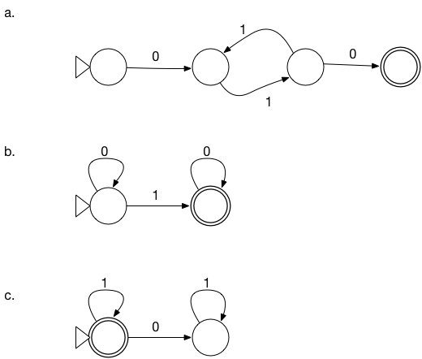

# FOCS Day 7 Homework

## 1. FSA to Regular Expression

Convert (a), and at least one of (b) and (c), to a regular expression.

**Solutions**:

a.

Either of:

	01(11)*0
	0(11)*10

b.

	0*10*

c.

	1*

## 2. Parenthesis Matching

**a**. Construct a regular expression that matches strings where each `(` is followed immediately by a `)`.

Positive examples: `()`, `()()()`

Negative examples: `(()`, `(())`

**Solution**:

Let L=`(` and R=`)`. Then a solution is:

	(LR)*

Without the substitution, and using the convention that `\(` represents the symbol `(` (and is not part of the grouping syntax):

	(\(\))*

**b**. Construct a regular expression that matches strings where the parentheses match, with depth <= 2.

Positive example: `()(()())()`

Negative examples: `((()))`, `((())())` have three levels of neseting.

**Solutions**:

	(L(LR)*R)*
	(\((\(\))*\))*

**c**. Construct a regular expression that accepts strings where the parentheses match, with depth <= 3.

Positive examples: `()(()())()`, `(()(()()))()`

Negative example: `(((())))` has four levels of nesting.

**Solutions**:

	(L(L(LR)*R)*R)*
	(\((\((\(\))*\))*\))*

## 3. [optional] Challenge Problems

Construct these. Some you may be able to do by just by thinking. Some may be easier if you construct an automaton and then convert it.

- A regular expression that matches strings with an odd number of 1s.

**Solution**: `0*(10*)10*`, `0*1(0*1)*0*`

- A regular expression that matches strings with an even number of 0s.

**Solution**: `(1*01*0)*1*`, `1*(01*01*)*`

- A regular expression that matches strings with an odd number of 1s AND an even number of 0s.

**Solution**: `1(0(11)*0)*` or `(0(11)*0)*1`

- A regular expression that matches strings with an odd number of 1s OR an even number of 0s.

**Solutions**:

	0*(10*)10* ∪ (1*01*0)*1*
	0*(10*)10* ∪ 1*(01*01*)*
	0*1(0*1)*0* ∪ (1*01*0)*1*
	0*1(0*1)*0* ∪ 1*(01*01*)*

## 4. [optional] Regular Expression practice
These are excellent sources to learn more about, and practice, applied regular expressions.

- [regexcrossword.com](https://regexcrossword.com)
- [regexone.com](https://regexone.com)

**Notes**:

(At least) two of you solved the [regular expression crossword](http://www.i-programmer.info/images/stories/News/2014/Dec/B/grid.pdf)! I believe you did it manually (let me know otherwise); this raises an interesting question, which we might address in a future Piazza post…

## 5. [optional] Extended Regular Expressions

Learn about [character classes](https://regexone.com/lesson/letters_and_digits) `\d\d\d-\d\d\d\d`, [repetition with quantifiers](https://regexone.com/lesson/repeating_characters) `a{2,4}`, [backreferences](http://www.regular-expressions.info/backref.html) `(a|b|c)def\1`, and [anchors](http://www.regular-expressions.info/anchors.html) (`\bword\b`).

Which of these are just notational conveniences, like `[abc]` for `(a|b|c)`?

Which increase the power of regular expressions?

**Solution**:

***Notational conveniences***

These are notational conveniences (cf. [syntactic sugar](https://en.wikipedia.org/wiki/Syntactic_sugar)):

*Character classes*:

* `[abc]` and `[a-c]` are shorthand for `(a|b|c)` (or `(a ∪ b ∪ c)`).
* `[^abc]` is shorthand for `[d-z]` (if Σ is the set of symbols {`a`, `b`, `c`, …, `z`}.)
* `\d` is shorthand for `[0-9]`.

*Repetition with quantifiers*:

* `a{2,4}` is shorthand for `aa(a(a)?)?` or `aaa?a?` [^1] – two required occurrences of `a` (`aa`), followed by 0, 1, or 2 occurrences of `a` (`(a(a)?)?` or `a?a?`).
* `a{2,}` is shorthand for `aaa*` – two required occurrences of `a`, followed by 0 or more (`a*`).
* `a{,4}` is shorthand for `a(a(a(a)?)?)?` or `a?a?a?a?`.

[^1]: `(a)?` is the same as `a?`; I've written it this way to bring out the recursive pattern in `(a(a)?)?`.

*Anchors* that match the *ends* of a string: `^` and `$` in default mode, `\A` and `\Z` in multi-line mode.

Regular expressions in theoretical computer science match a string only if they match the entirety of the string.

Regular expressions in text processing utilities and programming languages libraries, and  are often used to match *part of* a string.

So the theoretical computer science regular expression `ab` matches the string `ab`, but not the strings `abc` and `cab`. `ab` in a text procssing utility is equivalent to `.*ab.*`, and matches all of `ab`, `abc`, and `cab`.

(`.` in text processing regular expressions matches any character in the alphabet. If Σ={`a`, `b`, `c`}, then `.` is equivalent to `(a ∪ b ∪ c)`.)

`^` and `$` make a text processing regular expression act like a theoretical computer science regular expression:

| text processing expression | theoretical computer science regular expression |
|--------|----------|
| `ab`   | `.*ab.*` |
| `^ab`  | `ab.*`   |
| `ab$`  | `.*ab`   |
| `^ab$` | `ab`     |

*Anchors* that match *inside* a string: `^` and `$` in single-line mode; the [word boundary anchor](http://www.regular-expressions.info/wordboundaries.html) `\b`.

Consider the POSIX regular expression _\b_. It doesn't match (or consume) a character; instead, it places a restriction on the sets of pairs of (character that occurs before the anchor, character that occurs after the character): exactly one of the first and second item in this list must be in the set {`A`, `B`, …, `Z`, `a`, `b`, …, `z`, `0`, `1`, …, `9`, `_`}.

The regular expression _(x|@)y_ matches the strings `xy` and `@y`: because the regular expression _(x|@)_ matches both strings `x` and `-`. (`@` has no special meaning here. It's just a symbol that isn't in the set {`A`, …, `a`, …, `0`, …, `_`}.) 

The regular expression _(x|@)\by_, with an internal anchor, matches the string `@y`, but not the string `xy`. Even though the regular expression _{x|@}_ matches the string `x`, and the regular expression _y_ matches the string `y`, the regular expression _{x|@)\by_ matches only strings with a word boundary between the first character (left of the _\b_) and the second character (right of the _\b_).

Surprisingly(?), these *internal anchors* don't increase the expressive power. To show this, construct a FSA that accepts the strings matched by the regular expression.

Proof sketch:

1. Add `\w` (as a single symbol) to the alphabet.
2. Convert POSIX character classes to disjunctions, _e.g._ `[abc]` to `a|b|c`. Replace Kleene plus and other notational conveniences by the combination of concatenation, disjunction, and Kleene star that defines them. This produces a regular expression according to the formalism of theoretical computer science.
3. Convert this regular expression to a FSA.
4. For every state q_i that is at the terminus of (for example) three arrow with labels u, v, and w; and that originates (for example) two arrows with labels x and y: replace this state by 3 x 2 = 6 new states q1…q6, for each of -(u)→q1-(x)→, -(u)→q2-(y)→, -(v)→q2-(x)→, -(v)→q2-(y)→, _etc._  Each replacement leaves the language of the FSA unchanged, because for each pair of states q_j and q_k such that there's a path q_j -(u)→ q_i -(x)→ q_k, there is a path in the updated FSA q_j -(u)→ q1 -(x)→
5. Color some of the states. States at the terminus of a {`A`, `B`, …, `Z`, `a`, `b`, …, `z`, `0`, `1`, …, `9`, `_`} are blue. States at the terminus of any other label besides epsilon or `\w` are green.
6. Color some more of the states. If a state is not yet colored but is at the end of an arrow from a colored state, assign it the same color.
7. Remove `\b` arrows from a state to a state with the same color.
8. Re-label the remaining `\b` arrows with epsilons.

***Increased expressive power***

Adding these to regular expressions increases their expressive power:

*Back references*. The POSIX regular expression _(.*)\1_ (or _^(.*)\1$_ ) matches strings of the form $ww$ – a string that consists of a substring, followed by the same substring. For example, `abab` and `abcabc`, but not `abb`, `ababc`, or `abcab`.

Follow-on question:

How can you show that there's no push-down automaton or (theoretical computer science) regular expression that matches all and only the strings in this language?
