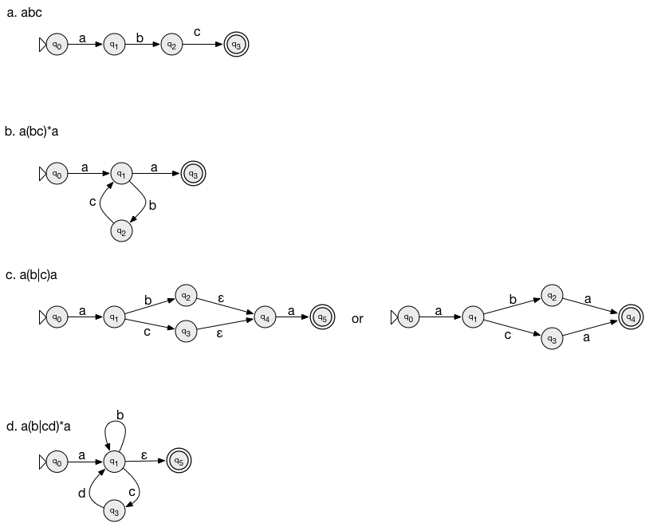

# FOCS Day 7 In Class

### 1. Core Regular Expressions

Rewrite these as extended regular expressions that use only:

- The `∪` (or `|`) and `*` operators
- Concatenation

a. `ba(na)+s`

**Answer:** `bana(na)*s` or `ba(na)*nas`

b. `boo?t`

**Answer:** `bo(o|epsilon)t`

c. `[cb]at`

**Answer:** `(c|b)at`

d. `c[^ct]t`, where Σ={a, b, c, t}

**Answer:** `c(a|b)t`

e. `c[^ct]t`, where Σ={a, b, c, t, x, y, z}

**Answer:** `c(a|b|x|y|z)t`

(`?` takes precedence over concatenation, so the second example is the same as `bo(o)?t`.)

### 2. Regular Expressions to Automata

Construct FSAs for the following regular expressions:

## Parsing

### 3. Parsing without whitespace

You are writing a recognizer for a calculator language that includes identifiers, numbers, and operators (just `+` and `-`) – no parentheses.

Another component has replaced identifiers by the letter I, numbers by the letter N, plus by P, and minus by M.

Symbol | Replaces
---|---|---
N (number) | 1, 10
I (identifier) | a, counter
P (`+` operator) | P
M (`-` operator) | M

Construct either an FSA, or a regular expression, that accepts / matches the valid expressions – numbers or identifiers, separated by operators.

Accept | Represents
---|---
`N` | `5`
`I` | `x`
`NPI` | `5+inc`
`NPN` | `10+20`
`NPNMI` | `10+11-x`

Reject | Represents
---|---
`NPPI` | `5++inc`
`NIPN` | `10x+20`
𝜀 | 𝜀 (empty string)

### 4. Parsing with whitespace

Modify your answer to the previous question to allow whitespace next to an operator.

Symbol | Examples
---|---|---
N (number) | 1, 10
I (identifier) | a, counter
P (`+` operator) | P
M (`-` operator) | M
W (whitespace) | [space character], [tab character]

Accept | Represents
---|---
`NWPI` | `5 +inc`
`NPWN` | `5+ inc`
`NWWWPWI` | `5   + inc`
