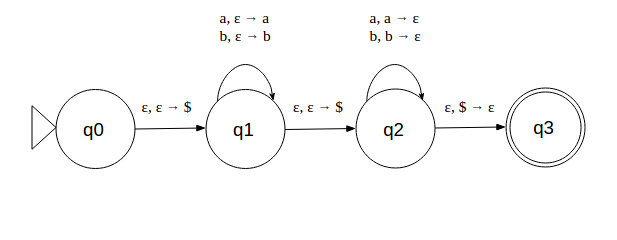

# FOCS Homework for Day 9

You may edit your answers into this file, or add a separate file in the same directory.

If you add a separate file, please include the following at the top:

```
Student Name: Shruti Iyer
Check one:
[ ] I completed this assignment without assistance or external resources.
[X] I completed this assignment with assistance from Annabel, David (I worked with them)
   and/or using these external resources: ___
```

## 1. For each of the following languages, decide whether it is regular

For each of the following languages, decide whether it is regular.  If it is regular, give a regular expression or finite automaton that recognizes the language.  If it is not regular, demonstrate that using the pumping lemma.

a) Strings containing only the symbol a whose length is a power of 2 (*i.e.* length 2^n)

[The strings `a`, `aa`, `aaaa`, and `aaaaaaaa` are in this language; the string `aaaaa` is not.]

**Ans:**	NOT a regular language

Using a string that is atleast 22 characters long

String provided by me: aaaaaaaaaaaaaaaaaaaaaaaaaaaaaaaa

Substring chosen: **aaaaaa**aaaaaaaaaaaaaaaaaaaaaaaaaa

Successfully pumped string: **aaaaaaaaaaaa**aaaaaaaaaaaaaaaaaaaaaaaaaa

b) All strings with an equal number of occurrences of the substrings `01` and `10`.

[010 is in this language; `000110` is in the language; `0101010` is in the language; but `010101` is not.]

**Ans:**	Regular language

Regex is (0[01]*0)|(1[01]*1)

If the string starts and ends with the same digit, there is a 01 to balance the other 10. If we are repeating any substring, there are two cases. Case 1: substring starts and ends with the same digit. Then, we know that there is a 01 matching the other 10. 

c) All strings (over {0,1}) consisting of a substring _w_ followed by the reverse of the substring.

[The strings `00100100` and `11110101011010101111` are in this language; the strings `00100` and `010101 `are not.]

**Ans:**	NOT a regular language

Using a string that is atleast  characters long

String provided by me: 11110101011010101111

Substring chosen: **1111**0101011010101111

Successfully pumped string: **11111111**0101011010101111

## 2. Play the pumping game

 Solve at least two puzzles from that page (that do NOT appear in question 1, above) and provide the word you chose, the substring the computer chose, and your successfully pumped string.

### Puzzle #1:

Here we go: The computer claims that the language

	L={w∈Σ∗∣|w|a<|w|b}

over the alphabet Σ={a,b} is regular. It also claims it can build a finite automaton accepting L using 13 states.

String provided by me: aaaaaaaaaaaaaabbbbbbbbbbbbbbbb

Substring the computer chose: aaaaaa**aaaaaa**aabbbbbbbbbbbbbbbb

Successfully pumped string: aaaaaa**aaaaaaaaaaaaaaaaaa**aabbbbbbbbbbbbbbbb

### Puzzle #2:

Here we go: The computer claims that the language

	L={a^n b^n∣n∈N}

over the alphabet Σ={a,b} is regular. It also claims it can build a finite automaton accepting L using 20 states.

String provided by me: aaaaaaaaaaaaaaaaaaaabbbbbbbbbbbbbbbbbbbb

Substring the computer chose: aaaaaaaaaa**a**aaaaaaaaabbbbbbbbbbbbbbbbbbbb

Successfully pumped string: aaaaaaaaaa**aaaaaaaaaaa**aaaaaaaaabbbbbbbbbbbbbbbbbbbb

### Puzzle #3:

Here we go: The computer claims that the language

	L={w∈Σ∗∣w=wR}

over the alphabet Σ={a,b} is regular. It also claims it can build a finite automaton accepting L using 10 states.

String provided by me: aaaaaaaaaabbbbbbbbbbaaaaaaaaaa

Substring the computer chose: a**aaaaa**aaaabbbbbbbbbbaaaaaaaaaa

Successfully pumped string: a**aaaaaaaaaa**aaaabbbbbbbbbbaaaaaaaaaa

## 3. Create a PDA

For one of the non-regular languages in problem 1 or 2 above, create a PDA (preferably in JFLAP) and include it with your completed homework.

Creating PDA for Puzzle #2



## 4. Reading

Optionally read Sipser pp. 101–125.

Optionally read Stuart pp. 128–134.

**Read Sipser**

## 5. Install gprolog

Please download and install [gprolog](http://www.gprolog.org) before coming to class:

**Ubuntu**:

	$ sudo apt-get install gprolog

**Mac**, with [Homebrew](http://brew.sh) installed:

	$ brew install gnu-prolog

**Mac** without Homebrew, and **Windows**:

- Follow the instructions at [http://www.gprolog.org/#download](http://www.gprolog.org/#download).

**Done**
