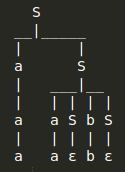
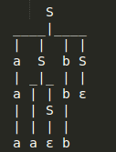

# FOCS Homework 9, for Day 10

You may edit your answers into this file, or add a separate file in the same directory.

If you add a separate file, please include the following at the top:

```
Student Name: Frankly Olin [change to your name]
Check one:
[ ] I completed this assignment without assistance or external resources.
[X] I completed this assignment with assistance from Annabel, David (Worked with them)
   and/or using these external resources: ___
```

## 1. Reading

Read Sipser pp. 101–125. (This was the optional reading for today. It is required for Monday.)

**Done**

## 2. Constructing Grammars

Construct a Context Free Grammar for each of the following languages.

a) All strings (over {0,1}) consisting of a substring _w_ followed by its reverse. (This is the same problem you were asked to work on in class.)

Give a derivation for `010010`.

**Ans.**

    S→ε
    S→0S0
    S→1S1

Derivation for `010010`

    S→0S0
    S→01S10
    S→010S010
    S→010ε010

b) All strings (over {a,b,c}) of the form a^{i}b^{i}c^{j}: an equal number of `a`s and `b`s, followed by any number of `c`s. For example, `aabb`, `aabbcc`, and `aabbcccc`, but not `aaaabbcc`.

**Ans.**

    S→XY
    X→aXb
    X→ε
    Y→cY
    Y→ε

c) All strings (over {a,b,c}) of the form a^{i}b^{j}c^{j}: any number of `a`s, followed by an equal number of `b`s and `c`s. For example, `abbcc`, `aabbcc`, and `aaaabbcc`, but not `aabbccc`.

**Ans.**

    S→XY
    X→Xa
    X→ε
    Y→bYc
    Y→ε

d) Give two distinct grammars that produce the strings described by the regular expression `(ab)*`: empty, `ab`, `abab`, `ababab`, ….

**Ans.**

```S→abS | ε```

    S→XY | ε
    X→Xab | ε
    Y→abY | ε

## 4. Ambiguous Grammars

Consider the grammar:

    S --> a S | a S b S | epsilon 

This grammar is ambiguous. Show in particular that the string `a a b` has
two:

a. parse trees

**Ans.**






b. leftmost derivations (These are the ones that, starting from the start variable, rewrite the leftmost nonterminal first.)

```S → aS → aaSbS → aaεbS → aaεbε → aab```

```S → aSbS → aaSbS → aaεbS → aaεbε → aab```

c. rightmost derivations (These are the ones that, starting from the start variable, rewrite the rightmost nonterminal first.)

```S → aS → aaSbS → aaSbε → aaεbε → aab```

```S → aSbS → aaSbS → aaSbε → aaεbε → aab```

Extra Credit/Challenge: Prove that this grammar generates all and only the strings of `a`s and `b`s such that every prefix has at least as many `a`s as `b`s. **Hint: Do the readings!**

## 5. [Optional] Play with Prolog

Read the page and download the sample files from [here](https://sites.google.com/site/focs16fall/prolog).

Warning: your instructor was unable to get these to reliably run today, and some of the instructions are from memory of when it previously worked. Your mileage may vary.